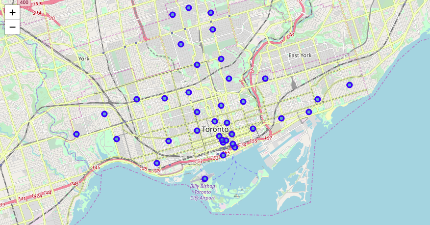
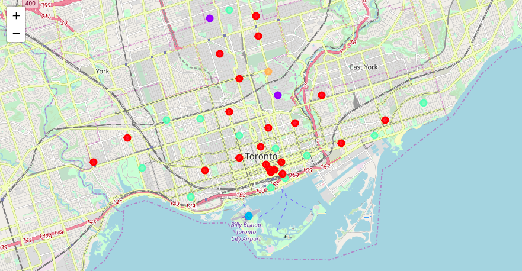

# Coursera_Capstone

This assignment required to explore and cluster neighborhoods in Toronto.

The list of Toronto postcodes, boroughs and neighborhoods was scrapped on the Toronto Wikipedia page using Beautiful Soup.
https://en.wikipedia.org/wiki/List_of_postal_codes_of_Canada:_M

The list of coordinates for each postcode was supplied by the program.
http://cocl.us/Geospatial_data

This information was combined to create a base Folium visualization of the different neighborhoods:

The Foursquare API was then used to gather the 100 surrounding venues for each postal code, along with venue categories.

Categories were then manually regrouped into bigger groups, which were used as discriminants to cluster neighborhoods together:

