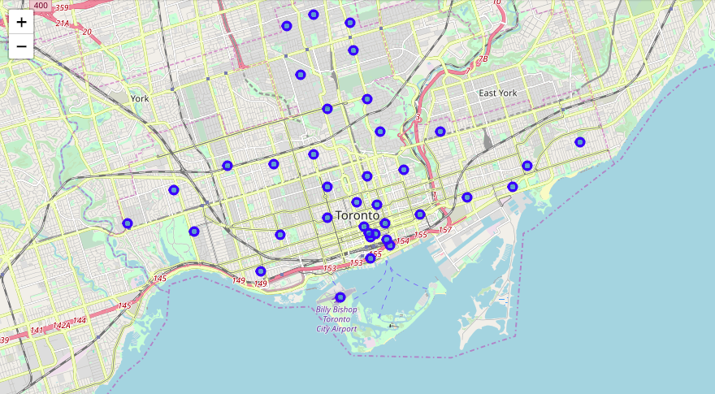
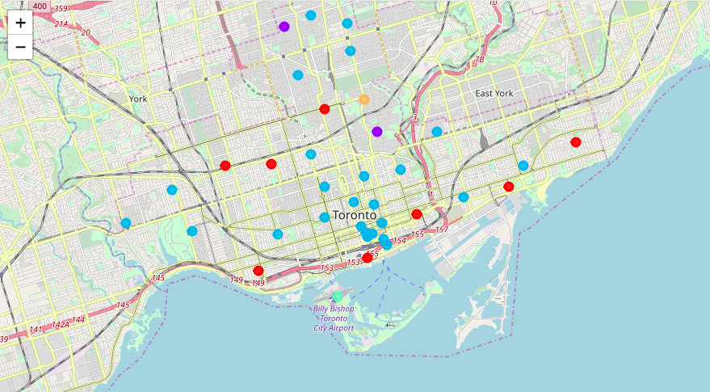
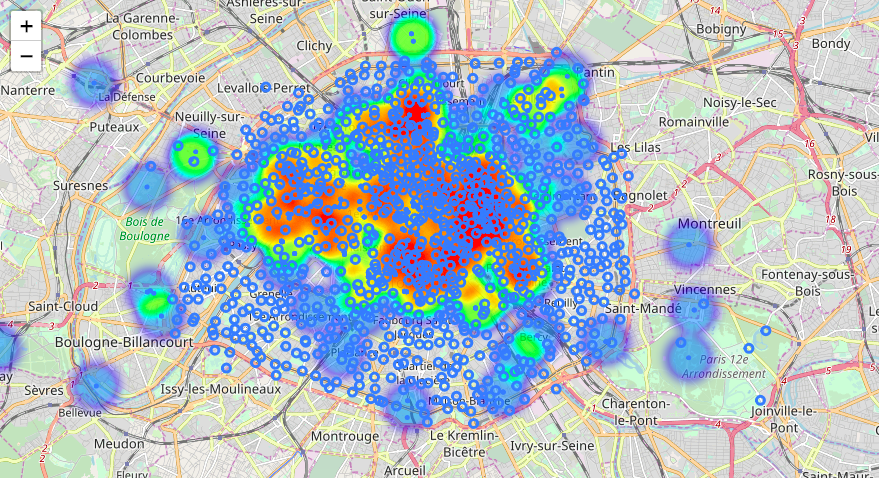

# Coursera_Capstone

"This capstone project course will give you a taste of what data scientists go through in real life when working with data. 

You will learn about location data and different location data providers, such as Foursquare. You will learn how to make RESTful API calls to the Foursquare API to retrieve data about venues in different neighborhoods around the world. You will also learn how to be creative in situations where data are not readily available by scraping web data and parsing HTML code. You will utilize Python and its pandas library to manipulate data, which will help you help you refine your skills for exploring and analyzing data. 

Finally, you will be required to use the Folium library to great maps of geospatial data and to communicate your results and findings."

## 1/ Toronto Neighborhood Clustering

This assignment required to explore and cluster neighborhoods in Toronto.

The list of Toronto postcodes, boroughs and neighborhoods was scrapped on the Toronto Wikipedia page using Beautiful Soup.

https://en.wikipedia.org/wiki/List_of_postal_codes_of_Canada:_M

The list of coordinates for each postcode was supplied by the program.

http://cocl.us/Geospatial_data

This information was combined to create a base Folium visualization of the different neighborhoods:

The Foursquare API was then used to gather the 100 surrounding venues for each postal code, along with venue categories.

Categories were then manually regrouped into bigger groups, which were used as discriminants to cluster neighborhoods together:

## 2/ Open Project

"Now that you have been equipped with the skills and the tools to use location data to explore a geographical location, you will have the opportunity to be as creative as you want and come up with an idea to leverage the Foursquare location data to explore or compare neighborhoods or cities of your choice or to come up with a problem that you can use the Foursquare location data to solve."

I chose to make up the following problem:

The Paris Mayor has received a budget for 10 new Vélib' stations to place in the city in 2019. His aim is to reduce areas that are commercially dense but don’t have a nearby station. He has asked for a recommendation of areas to target.

Using the Google Geocoding API and the official Paris database, I created a visualization of the current Vélib' stations in Paris:

Using the Foursquare Places API, I added a heatmap layer of commercial venue concentration:

This allowed to find the zones which were commercially dense but not sufficially covered by stations:

